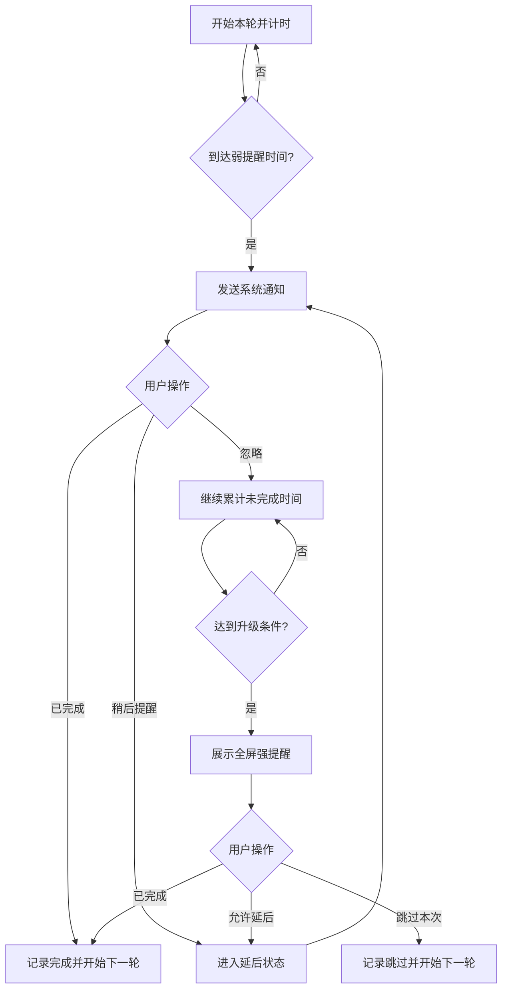

# 叮刻 LoopCue 产品需求文档

> 不只提醒时间，也等待你的回应。

| 项目 | 内容 |
| --- | --- |
| 文档版本 | v0.1 |
| 产品阶段 | MVP 定义 |
| 平台 | macOS |
| 产品形态 | 菜单栏常驻应用 |
| 工作名称 | 叮刻 LoopCue |
| 核心品类 | 渐进式周期提醒器 |
| 数据策略 | 本地优先，不要求账号 |

## 1. 产品摘要

叮刻是一款面向 macOS 的周期提醒应用。它适合起身、喝水、远眺、拉伸等需要反复执行的小行动。

叮刻与普通闹钟或待办应用的区别是：提醒发出后，本轮任务不会自动被视为完成。用户必须明确点击“已完成”，或者触发该提醒预先配置的完成条件；如果用户持续不回应，提醒会从系统通知逐步升级为更明显的全屏提醒。

一句话定义：

> 一个需要回应、被忽略后会升级的周期提醒器。

## 2. 背景与问题

### 2.1 用户问题

现有提醒工具通常只负责“在某个时刻发出通知”，但不关心用户是否采取行动。周期性小事尤其容易出现以下问题：

- 用户处于专注状态，随手忽略通知，之后彻底忘记。
- 通知消失后没有后续动作，“提醒过”被误当成“完成了”。
- 普通提醒过于温和，强制休息工具又从一开始就过度打断。
- 久坐、喝水、护眼等工具各自独立，用户需要安装多个功能相似的应用。
- 电脑睡眠、锁屏或用户离开后，固定计时器仍然累计，导致恢复工作时错误提醒。

### 2.2 产品机会

将“周期提醒”抽象成一个带状态的行动闭环：

1. 到达周期后先温和提醒。
2. 等待用户回执，而不是自动结束。
3. 未收到回执时继续累计。
4. 达到升级条件后提高提醒强度。
5. 完成、跳过或符合自动完成条件后，明确结束本轮。

现有产品普遍具备周期通知或全屏休息能力，但“弱提醒 → 等待回执 → 未回应 → 自动升级”的完整机制不是主流默认体验。这是叮刻的核心差异。

## 3. 产品目标

### 3.1 MVP 目标

- 用户能在 1 分钟内创建第一个周期提醒。
- 支持“系统通知”和“全屏提醒”两级提醒。
- 只有明确完成或满足完成策略时，本轮才会重置。
- 正确处理睡眠、锁屏、长时间离开和应用重启。
- 起身、喝水、远眺三个模板开箱即用。
- 应用安静、轻量，不需要注册，不依赖网络。

### 3.2 非目标

MVP 不做以下能力：

- 一次性待办、项目管理、日历管理。
- 团队任务、打卡排名和社交功能。
- iPhone、iPad、Apple Watch 多端同步。
- 通过摄像头识别喝水、起身或动作是否真实完成。
- 完全锁死键鼠、阻止强制退出或模拟系统锁屏。
- 无限层级的自动化工作流。MVP 固定为弱提醒和强提醒两级。
- 医疗建议、用药剂量判断或健康诊断。

## 4. 目标用户与核心场景

### 4.1 目标用户

- 长时间使用 Mac 的开发者、设计师、创作者和办公室职员。
- 经常进入深度工作、容易忽略普通通知的人。
- 想养成简单健康习惯，但不希望使用复杂习惯打卡产品的人。
- 使用升降桌，希望交替坐立的人。

### 4.2 核心使用场景

| 场景 | 周期 | 弱提醒 | 建议升级条件 | 完成动作 |
| --- | ---: | --- | ---: | --- |
| 起身活动 | 30 分钟 | 该起来走一走了 | 未回应 30 分钟 | 已起身 |
| 喝水 | 45 分钟 | 喝几口水吧 | 未回应 15 分钟 | 已喝水 |
| 远眺护眼 | 20 分钟 | 看向 6 米外，放松 20 秒 | 未回应 5 分钟 | 已远眺 |
| 肩颈拉伸 | 60 分钟 | 活动一下肩颈 | 未回应 15 分钟 | 已拉伸 |
| 自定义 | 用户设置 | 用户填写 | 用户设置 | 用户填写 |

## 5. 核心概念

### 5.1 周期行动

用户创建的提醒对象。每个周期行动包含：

- 名称与图标。
- 提醒文案。
- 完成按钮文案。
- 周期。
- 生效日期和时段。
- 弱提醒方式。
- 升级等待时长。
- 强提醒方式。
- 延后、跳过和离开电脑策略。

### 5.2 一轮

从上一次完成、跳过或启用提醒开始，到本次完成或跳过为止，称为“一轮”。

系统必须区分：

| 操作 | 是否记为完成 | 是否结束本轮 | 下一轮如何开始 |
| --- | ---: | ---: | --- |
| 已完成 | 是 | 是 | 从完成时间重新计时 |
| 稍后提醒 | 否 | 否 | 延迟当前提醒，不重置原始周期 |
| 忽略通知 | 否 | 否 | 继续等待并累计至升级条件 |
| 跳过本次 | 否 | 是 | 从跳过时间开始下一轮 |
| 暂停提醒 | 否 | 否 | 恢复后继续剩余时间 |
| 自动完成 | 是 | 是 | 从识别到完成条件的时间重新计时 |

### 5.3 提醒等级

MVP 只提供两级，保证容易理解和配置：

- 弱提醒：macOS 系统通知，包含“已完成”和“稍后提醒”操作。
- 强提醒：覆盖屏幕的应用内全屏界面，显示行动、等待时长和完成操作。

强提醒不是第二套独立定时器，而是当前一轮持续未完成的升级结果。

## 6. 核心体验流程

### 6.1 首次启动

1. 展示一句产品说明：“叮刻会先轻轻提醒；如果没有收到回应，会按你的设置再次出现。”
2. 用户选择一个模板：起身、喝水、远眺或自定义。
3. 用户确认模板的周期和升级时间。
4. 应用解释通知用途并申请系统通知权限。
5. 创建成功，菜单栏开始显示距离下一次提醒的时间。
6. 引导页结束后，可选申请“登录时启动”。拒绝不影响核心功能。

首次启动不一次性申请与当前功能无关的权限。

### 6.2 正常提醒流程



### 6.3 弱提醒

系统通知包含：

- 标题：行动名称，例如“该喝水了”。
- 正文：简短行动建议，例如“喝几口水，让自己缓一缓。”
- 主操作：自定义完成文案，例如“已喝水”。
- 次操作：“10 分钟后提醒”。
- 点击通知正文：打开该行动的详情浮窗。

规则：

- 通知送达不等于完成。
- 通知自动消失、被清除或开启勿扰模式都视为“未回应”。
- 在升级前完成，立即取消该轮尚未送达的通知和强提醒。
- 通知权限被关闭时，在菜单栏明确显示异常状态。

### 6.4 强提醒

强提醒默认覆盖所有已连接显示器，设置中可改为仅当前显示器。界面包括：

- 行动名称和图标。
- 提醒文案。
- “已经等待 XX 分钟”的状态说明。
- 主按钮：自定义完成文案。
- 次按钮：“跳过本次”。
- 如果该行动允许延后，则显示“稍后提醒”。
- 一个始终可发现的安全退出方式。严格模式可增加操作摩擦，但不得阻止用户退出应用或处理紧急工作。

强提醒出现时：

- 不关闭或修改用户正在使用的应用和文档。
- 不模拟系统登录窗口，不索取辅助功能权限来锁死键鼠。
- 切换显示器、拔插显示器时，覆盖窗口应正确重建。
- 系统重启后不立即恢复全屏覆盖；先恢复状态，并给用户至少 10 秒缓冲。

### 6.5 菜单栏

菜单栏是日常主入口。默认显示最近一次即将触发的提醒和倒计时。展开后显示：

- 下一项：行动名称、距离弱提醒的时间。
- 进行中：已经发出但尚未完成的行动，标记“等待回应”。
- 快捷操作：已完成、稍后提醒、跳过本次。
- “暂停 30 分钟”“暂停 1 小时”“暂停到明天”。
- “立即提醒一次”。
- 打开提醒列表、设置和退出应用。

若多个提醒同时等待回应，菜单栏优先展示升级时间最近的一项。

## 7. 功能需求

优先级定义：P0 为 MVP 上线必需，P1 为首个功能更新，P2 为后续探索。

### F-01 创建和编辑周期行动（P0）

用户可以从模板创建，也可以自定义以下字段：

- 名称：1～20 个字符。
- 图标：系统符号或 Emoji。
- 弱提醒文案：最多 80 个字符。
- 完成按钮文案：最多 8 个字符。
- 周期：5 分钟～24 小时。
- 升级等待：关闭，或 1 分钟～24 小时。
- 生效日：周一至周日多选。
- 生效时段：支持跨日以前的单个时段；MVP 暂不支持同一天多个时段。
- 是否允许延后、延后时长、每轮最多延后次数。
- 强提醒覆盖当前显示器或所有显示器。
- 是否启用。

验收标准：

- 必填项缺失或升级时间不合理时，界面给出就地错误提示。
- 保存后 1 秒内出现在提醒列表和菜单栏中。
- 编辑当前正在进行的一轮时，明确提示新设置是立即应用还是从下一轮应用；默认从下一轮应用。

### F-02 模板（P0）

提供起身、喝水、远眺和自定义四个入口。模板只是预填配置，创建后可自由修改。

| 模板 | 周期 | 升级等待 | 延后 | 离开电脑策略 |
| --- | ---: | ---: | --- | --- |
| 起身 | 30 分钟 | 30 分钟 | 10 分钟，最多 2 次 | 离开 3 分钟可视为完成，默认开启 |
| 喝水 | 45 分钟 | 15 分钟 | 10 分钟，最多 2 次 | 离开期间暂停，默认不自动完成 |
| 远眺 | 20 分钟 | 5 分钟 | 5 分钟，最多 1 次 | 离开期间暂停，默认不自动完成 |
| 自定义 | 60 分钟 | 关闭 | 10 分钟，最多 2 次 | 离开期间暂停 |

### F-03 计时和调度（P0）

- 基于持久化时间点计算状态，不能依赖一个只在进程存活期间运行的 Timer。
- 应用退出、崩溃或系统重启后可以恢复每个行动的轮次状态。
- 睡眠和锁屏期间默认不累计“电脑使用型”周期。
- 唤醒后重新计算剩余时间，不补发睡眠期间积压的多条提醒。
- 用户手动修改系统时间后，应重新计算计划并避免重复提醒。
- 生效时段结束时冻结当前轮；下一个生效时段继续剩余时间。

### F-04 弱提醒（P0）

- 使用 macOS 本地通知。
- 每个通知关联唯一的行动 ID 和轮次 ID。
- 支持“已完成”和“稍后提醒”操作。
- 用户从通知完成后，菜单栏和提醒列表在 1 秒内更新。
- 通知权限拒绝或后续被关闭时，应用内展示修复入口。

### F-05 强提醒（P0）

- 到达升级条件后，在目标显示器创建全屏覆盖窗口。
- 多显示器窗口必须属于同一轮，任意屏幕点击完成后全部关闭。
- 覆盖窗口需支持全屏应用和不同 Space。
- 窗口关闭、应用失焦或显示器配置变化不能把本轮误记为完成。
- 必须支持 VoiceOver、键盘焦点移动和 Escape 安全操作。

### F-06 回执操作（P0）

- 完成、延后、跳过必须是三个不同事件。
- 所有入口执行同一套业务逻辑，避免通知、菜单栏和全屏窗口状态不一致。
- 同一轮的完成操作必须幂等；重复点击只产生一条完成记录。
- 延后不修改原始周期，只修改当前轮的下次提醒时间。
- 达到每轮延后上限后，不再显示延后按钮。

### F-07 暂停（P0）

支持：

- 暂停单个行动。
- 暂停全部行动 30 分钟、1 小时或到明天。
- 手动恢复。

暂停期间不累计时间；恢复后从原剩余时间继续。暂停不是跳过或完成。

### F-08 离开电脑、锁屏与睡眠（P0）

- 使用系统空闲时间判断用户是否离开电脑，默认阈值 5 分钟。
- 离开期间暂停依赖电脑使用时长的周期。
- 每个行动可以选择“离开达到 N 分钟视为完成”。此能力默认只在起身模板开启。
- 无法可靠判断动作是否完成时，宁可暂停或等待确认，不应把喝水等行为自动标记完成。
- 锁屏和系统睡眠视为离开。

### F-09 列表与状态（P0）

提醒列表展示：

- 名称、图标和启用状态。
- 距离弱提醒的剩余时间，或“等待回应/即将升级”。
- 最近一次完成时间。
- 编辑、启停和删除。

删除一个正在等待回应的行动时，需要二次确认，并取消相关通知与覆盖窗口。

### F-10 本地记录（P1）

按天展示完成、跳过和延后的次数。MVP 内部保留事件数据结构，但不必提供完整统计页面。

### F-11 情境感知（P1）

- 检测屏幕共享、演示和视频会议时，暂缓强提醒。
- 支持应用白名单，例如 Keynote、Zoom 或游戏运行时只发弱提醒。
- 情境结束后提供短暂缓冲，不立即全屏打断。

该能力依赖 macOS 可公开使用且符合上架规则的信号；无法可靠识别时，应提供用户可控的会议暂停模式，不做虚假承诺。

### F-12 更多升级层级（P2）

允许配置“通知 → 重复通知/声音 → 居中浮层 → 全屏”的多级阶梯。MVP 先通过两级模型验证需求。

## 8. 状态机与规则

### 8.1 行动状态

| 状态 | 含义 | 可进入的下一状态 |
| --- | --- | --- |
| Disabled | 行动已关闭 | Counting |
| Counting | 正在累计有效时间 | WeakPending、Paused、Disabled |
| WeakPending | 弱提醒已发出，等待回应 | Counting、Snoozed、StrongPending、Paused |
| Snoozed | 当前轮已延后 | WeakPending、StrongPending、Paused |
| StrongPending | 强提醒已展示，等待回应 | Counting、Snoozed、Paused |
| Paused | 单项或全局暂停 | 原状态、Disabled |

完成或跳过后状态回到 Counting，但两者产生不同事件记录。

### 8.2 推荐时间模型

每一轮至少持久化：

- `cycleStartedAt`：本轮开始时间。
- `activeElapsed`：已经累计的有效使用时长。
- `lastActiveAt`：上次进入有效计时的时间。
- `weakTriggeredAt`：弱提醒触发时间，可为空。
- `strongDueAt`：当前预计升级时间，可为空。
- `snoozeUntil`：延后截止时间，可为空。
- `cycleID`：防止跨轮误操作。
- `status`：当前状态。

对于间隔型提醒，周期优先按有效使用时长计算；固定时间提醒属于后续能力，不混入 MVP。

### 8.3 多提醒冲突

当多个行动同时触发：

- 弱提醒可以分别进入系统通知中心。
- 同一时刻只展示一个强提醒主卡片，按“强提醒到期时间最早，其次创建时间最早”排序。
- 其余强提醒在同一覆盖界面显示为待处理数量，完成当前项后展示下一项。
- 完成一个行动不得重置其他行动。
- 全局暂停同时冻结所有待处理行动。

## 9. 信息架构

### 9.1 菜单栏弹窗

- 下一个提醒
- 等待回应
- 暂停快捷操作
- 立即提醒
- 打开叮刻
- 设置
- 退出

### 9.2 主窗口

- 提醒列表
- 新建/编辑提醒
- 今日记录（P1）
- 设置
  - 通知权限状态
  - 登录时启动
  - 默认覆盖显示器
  - 默认离开阈值
  - 声音与外观
  - 数据与隐私

## 10. 关键界面文案

### 10.1 首次启动

- 标题：让周期提醒真正有回应
- 正文：叮刻会先轻轻提醒。如果你没有回应，它会按你的设置再次出现。
- 主按钮：创建第一个提醒

### 10.2 通知权限

- 标题：允许叮刻发送通知
- 正文：弱提醒通过 macOS 通知发送。你可以直接在通知中完成或延后。
- 主按钮：继续
- 次按钮：稍后设置

### 10.3 强提醒

- 状态：这项行动已经等待 30 分钟
- 主按钮：已完成
- 次按钮：跳过本次
- 延后按钮：10 分钟后提醒

### 10.4 权限异常

- 标题：系统通知已关闭
- 正文：叮刻仍在计时，但无法发送弱提醒。你可以前往系统设置重新开启。
- 按钮：打开通知设置

## 11. 视觉与交互原则

- 弱提醒遵循系统体验，不制造额外悬浮干扰。
- 强提醒应明确但不恐吓，避免红色警告、虚假系统界面和惩罚性文案。
- 强提醒展示“为什么出现”：例如“30 分钟前提醒过你喝水，但还没有收到回应”。
- 完成按钮始终是最突出、最容易操作的动作。
- 跳过和退出可以增加轻微摩擦，但不能隐藏到用户无法发现。
- 支持浅色、深色、减少动态效果和提高对比度。
- 不只通过颜色表达等待、完成或异常状态。

## 12. 隐私与安全

- 所有提醒配置、状态和历史默认只存储在本机。
- MVP 不创建账号、不上传行为记录、不接入广告 SDK。
- 空闲检测只读取“距离上次键鼠输入的时长”，不记录按键内容、鼠标位置或应用输入。
- 不使用摄像头和麦克风。
- 如果未来加入可选分析，必须单独征得同意，并提供完全关闭与删除数据的入口。
- 用药等模板只能作为通用提醒，必须避免暗示替代医生建议或医疗设备。

## 13. macOS 技术方案建议

### 13.1 技术选型

- 最低系统：建议 macOS 13 Ventura；开发前根据目标用户分布再次确认。
- 语言：Swift。
- UI：SwiftUI 为主，AppKit 负责状态栏和多显示器覆盖窗口。
- 通知：`UNUserNotificationCenter`，注册带操作按钮的通知 Category。
- 登录启动：`SMAppService`。
- 持久化：Core Data 或轻量本地数据库；设置项可使用 `UserDefaults`。
- 系统事件：监听睡眠、唤醒、锁屏、解锁和显示器变化通知。
- 空闲时间：优先使用无需读取输入内容的系统空闲时长 API。

### 13.2 模块划分

| 模块 | 职责 |
| --- | --- |
| ReminderStore | 保存提醒配置、轮次状态和事件 |
| Scheduler | 计算下一事件、恢复状态、处理时间变化 |
| ActivityMonitor | 处理空闲、锁屏、睡眠和唤醒 |
| NotificationCoordinator | 请求权限、发送通知、接收操作回调 |
| OverlayPresenter | 管理所有显示器上的强提醒窗口 |
| ReminderEngine | 执行完成、延后、跳过、暂停等统一状态转换 |
| MenuBarController | 展示最近提醒与快捷操作 |

`ReminderEngine` 应是唯一能够修改轮次状态的入口。通知、菜单栏和全屏界面只发送意图，避免多个界面各自维护计时状态。

### 13.3 调度原则

- 不把 `Timer` 当作事实来源。Timer 只用于刷新界面，实际状态由持久化时间点和有效累计时长推导。
- 每次启动、唤醒、解锁、系统时间变化或设置修改后，重新计算所有行动的下一事件。
- 通知回调携带 `reminderID + cycleID`。若 cycleID 已过期，忽略回调，防止用户点击旧通知影响新一轮。
- 强提醒由应用内调度触发。本地通知无法保证在专注模式下即时可见，因此不能作为强提醒的唯一机制。

### 13.4 全屏实现边界

建议为每个 `NSScreen` 创建无边框窗口，并配置为可加入所有 Space、可与全屏应用并存。需要在以下环境验证窗口层级和焦点行为：

- 单显示器与多显示器。
- 每个显示器独立 Space 开关状态。
- 其他应用处于原生全屏。
- 舞台管理器。
- 外接显示器热插拔。
- 锁屏、唤醒和快速用户切换。

macOS 始终允许用户切换应用、退出进程或使用系统快捷键。产品文案应称为“全屏强提醒”，不应承诺不可绕过的“强制锁定”。

## 14. 数据模型草案

### Reminder

```text
id: UUID
name: String
icon: String
message: String
completionLabel: String
intervalSeconds: Int
escalationDelaySeconds: Int?
activeWeekdays: Set<Weekday>
activeStartMinute: Int
activeEndMinute: Int
snoozeSeconds: Int
maxSnoozeCount: Int
awayPolicy: pause | complete
awayThresholdSeconds: Int
displayScope: current | all
isEnabled: Bool
createdAt: Date
updatedAt: Date
```

### ReminderCycle

```text
id: UUID
reminderID: UUID
status: counting | weakPending | snoozed | strongPending | paused
startedAt: Date
activeElapsedSeconds: Int
lastActiveAt: Date?
weakTriggeredAt: Date?
strongDueAt: Date?
snoozeUntil: Date?
snoozeCount: Int
pausedFromStatus: Status?
```

### ReminderEvent

```text
id: UUID
reminderID: UUID
cycleID: UUID
type: weakTriggered | strongTriggered | completed | autoCompleted | snoozed | skipped | paused | resumed
source: notification | overlay | menuBar | mainWindow | system
occurredAt: Date
```

## 15. 验收测试清单

### 15.1 核心闭环

1. 创建周期 5 分钟、升级等待 2 分钟的测试提醒。
2. 5 分钟后收到包含完成和延后操作的系统通知。
3. 不操作通知，2 分钟后出现全屏提醒。
4. 点击完成，所有显示器上的覆盖窗口关闭。
5. 下一轮从完成时间重新计时。
6. 历史中只产生一条完成事件。

### 15.2 必测边界

| 场景 | 预期结果 |
| --- | --- |
| 弱通知被清除 | 不记完成，仍按时升级 |
| 点击旧轮次的通知 | 不影响当前轮次 |
| 弱提醒后重启应用 | 恢复等待状态并在到期后升级 |
| 计时中进入睡眠 | 睡眠期间不累计，唤醒后继续 |
| 强提醒时拔掉显示器 | 对应窗口销毁，其余窗口仍正常 |
| 多屏任一屏点击完成 | 全部覆盖窗口关闭，只记录一次 |
| 达到延后次数上限 | 所有入口不再提供延后 |
| 通知权限关闭 | 菜单栏和设置显示异常，不误报已提醒 |
| 修改系统时间 | 不重复触发、不产生负倒计时 |
| 两个提醒同时升级 | 只显示一个主行动，并可依次处理 |
| 生效时段结束 | 冻结剩余时间，不在非生效时段升级 |
| 退出强提醒但未完成 | 本轮保持未完成，不重置计时 |

## 16. 成功标准

MVP 阶段优先通过小规模测试验证核心价值，不急于接入行为分析 SDK。建议邀请 20～50 名高频 Mac 用户试用两周，关注：

- 80% 的测试用户能在首次启动后 1 分钟内创建提醒。
- 至少 60% 的用户在第 7 天仍保留一个启用中的提醒。
- 至少 30% 的弱提醒获得直接完成回执。
- 收到强提醒的用户中，至少 50% 表示升级机制“有帮助且可以接受”。
- 因误判睡眠、离开或时间状态导致的错误强提醒，每位用户每周少于 1 次。
- 崩溃、状态丢失和重复完成属于发布阻断问题。

产品不应单纯追求强提醒触发率。理想结果是用户在弱提醒阶段完成行动，强提醒只作为必要兜底。

## 17. 版本规划

### M0：交互原型（约 1 周）

- 菜单栏倒计时。
- 单个硬编码提醒。
- 可操作的系统通知。
- 单屏全屏提醒。
- 验证通知回调和窗口层级。

### M1：可用 MVP（约 3～5 周）

- 多提醒与四个模板。
- 完整两级状态机。
- 多显示器强提醒。
- 睡眠、锁屏、离开和重启恢复。
- 暂停、延后、跳过。
- 通知权限和登录启动。
- 本地事件记录。

### M2：封闭测试（约 2 周）

- 修复多屏、Space 和系统时间边界。
- 完成无障碍、性能和耗电测试。
- 根据反馈调整默认周期、升级时间和文案。
- 准备隐私政策、帮助页和上架素材。

### M3：首个功能更新

- 今日/每周记录。
- 会议和演示暂停。
- 更丰富的提醒声音与外观。
- 配置导入导出。

### 后续探索

- iPhone 与 Apple Watch 回执。
- iCloud 同步。
- 多级提醒阶梯。
- 快捷指令和 URL Scheme。
- 根据用户响应习惯自动建议更合适的提醒周期，但不擅自修改设置。

## 18. 发布前待决策项

以下问题不阻塞原型，但应在进入封闭测试前确定：

1. 正式品牌名是否使用“叮刻 LoopCue”，以及商标、域名和 App Store 名称是否可用。
2. 最低支持 macOS 13 还是 macOS 14。
3. 强提醒默认覆盖所有显示器，还是只覆盖当前显示器。当前建议为所有显示器。
4. 免费、一次性买断或基础免费加 Pro。MVP 建议先免费测试，不提前复杂化付费墙。
5. 起身模板的“离开 3 分钟自动完成”是否默认开启，需要通过测试观察误判率。
6. 是否首发 Mac App Store；若同时提供官网版本，需要设计签名、公证和自动更新方案。

## 19. MVP 发布定义

当且仅当以下条件全部满足，MVP 才可进入外部测试：

- 用户可创建、编辑、启停和删除提醒。
- 弱提醒、未回应升级、强提醒、完成重置形成完整闭环。
- 完成、延后、跳过和暂停的语义在所有入口一致。
- 睡眠、锁屏、重启和多显示器场景不会造成状态丢失或重复完成。
- 通知权限异常有清晰的用户修复路径。
- 强提醒始终有安全退出方式，并通过基础无障碍检查。
- 应用无需账号和网络即可完成所有核心功能。

