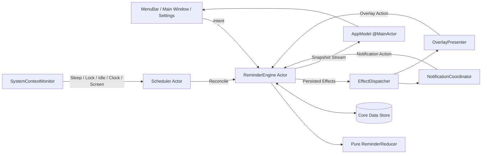
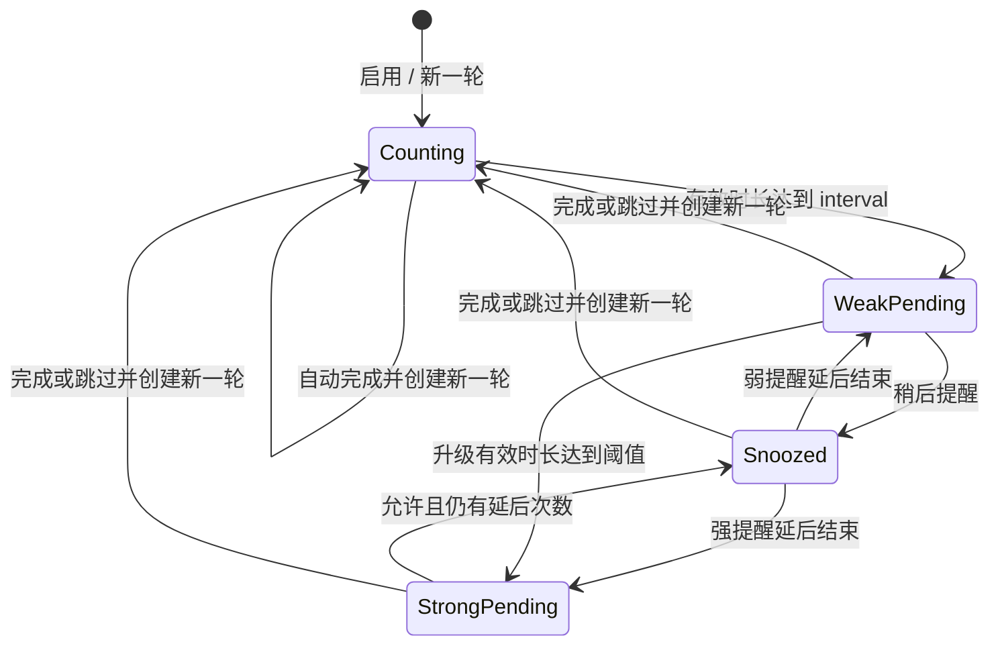

# 叮刻 LoopCue 技术方案

> 基于《LoopCue 产品需求文档 v0.1》的 macOS MVP 落地方案。

| 项目 | 内容 |
| --- | --- |
| 文档版本 | v0.1 |
| 对应产品文档 | `docs/LoopCue-PRD-v0.1.md` |
| 目标版本 | M0 原型、M1 可用 MVP |
| 目标平台 | macOS 13 Ventura 及以上 |
| 技术栈 | Swift、SwiftUI、AppKit、Core Data |
| 应用形态 | 单进程菜单栏常驻应用 |
| 数据策略 | 本地存储，无账号、无网络依赖 |
| 文档状态 | 可进入工程初始化和任务拆分 |

## 1. 方案摘要

LoopCue 采用原生 macOS 单体架构。SwiftUI 负责菜单栏、提醒列表、编辑页和设置页，AppKit 负责多显示器全屏覆盖窗口；所有业务状态由一个串行的 `ReminderEngine` 管理，并通过 Core Data 持久化。

系统的核心不是若干独立计时器，而是一个可恢复的状态机：

```text
有效使用时长达到周期
    → 发送弱提醒并等待回执
    → 未回应的有效时长达到升级阈值
    → 展示全屏强提醒
    → 完成或跳过后开启新一轮
```

技术实现遵循四条原则：

1. `Timer` 只负责唤醒，不是时间事实来源。
2. 完成、延后、跳过、暂停等写操作只能经过 `ReminderEngine`。
3. 业务状态转换与待执行系统副作用在同一事务内落盘。
4. 无法判断应用退出期间用户是否在电脑前时，不累计该段时间，避免错误强提醒。

## 2. 目标与范围

### 2.1 技术目标

- 完整实现 PRD 中 P0 的两级提醒闭环。
- 支持多个提醒独立计时、独立完成和有序强提醒。
- 应用重启、崩溃、睡眠、锁屏、闲置和修改系统时间后状态可恢复。
- 通知、菜单栏、主窗口和全屏界面共享同一业务状态。
- 不获取辅助功能、输入监听、摄像头或麦克风权限。
- 核心状态机可通过纯单元测试覆盖，不依赖真实时间和真实系统通知。
- 为 P1 统计、情境感知和未来多级提醒保留扩展点。

### 2.2 本方案不覆盖

- iOS、iPadOS、watchOS 客户端和 iCloud 同步。
- 团队服务端、账号、远程推送和遥测平台。
- 使用辅助功能权限锁定键鼠。
- 视频会议和屏幕共享的自动识别；MVP 只提供手动暂停。
- 固定时间提醒和跨日生效时段。
- 三层及以上的提醒升级工作流。

## 3. 关键技术决策

| 决策 | 选择 | 原因 |
| --- | --- | --- |
| 最低系统 | macOS 13 | 可使用 `MenuBarExtra`，同时覆盖较多仍在使用的设备 |
| UI | SwiftUI 为主、AppKit 补充 | 普通页面开发效率高，全屏多窗口仍需 AppKit 精细控制 |
| 应用进程 | 单进程菜单栏 Agent | MVP 无需 XPC 和额外登录项进程，状态一致性更简单 |
| 持久化 | Core Data SQLite Store | macOS 13 原生可用，支持事务、迁移和唯一约束 |
| 状态并发 | Swift Actor 串行写入 | 防止通知回调和 UI 同时完成造成重复事件 |
| 时间源 | 运行中使用单调时钟，落盘保存累计秒数 | 避免系统改时直接造成倒计时跳变 |
| 弱提醒 | `UNUserNotificationCenter` 本地通知 | 原生通知操作、勿扰模式和系统设置集成 |
| 强提醒 | 每个 `NSScreen` 一个无边框 `NSPanel` | 支持多屏、Space 和全屏应用场景 |
| 空闲判断 | Core Graphics 的系统空闲时长 | 只读取距上次输入的时间，不读取输入内容 |
| 登录启动 | `SMAppService` | macOS 13 原生公开 API，符合沙盒和上架要求 |
| 外部副作用 | 持久化 Outbox | 状态落盘后崩溃，重启仍可补发通知或恢复覆盖窗口 |

### 3.1 MVP 对产品语义的补充约定

PRD 对部分边界未给出唯一解释。技术实现先采用以下明确语义，进入 M1 前应由产品确认：

- 延后会冻结当前轮的升级倒计时。弱提醒阶段延后结束后再次发送弱提醒，并继续剩余升级时长；强提醒阶段延后结束后直接恢复全屏提醒。
- 延后期间睡眠、锁屏、闲置和非生效时段均不消耗延后时间。
- 从强提醒按 Escape 或“暂时关闭”退出，不视为完成或跳过；覆盖窗口隐藏 5 分钟，仍未处理则再次出现。
- “立即提醒一次”让当前轮立即进入弱提醒阶段，不额外创建一轮。
- 应用被用户主动退出后不承诺继续触发强提醒；再次启动时恢复原状态。
- 应用不在运行期间的未知时间不计入有效时长。

## 4. 系统架构



### 4.1 分层

| 层 | 主要内容 | 约束 |
| --- | --- | --- |
| Presentation | 菜单栏、列表、编辑页、设置、全屏卡片 | 不直接写数据库，不自行计算业务状态 |
| Application | Engine、Scheduler、EffectDispatcher、SystemContextMonitor | 编排用例和系统事件 |
| Domain | Reminder、Cycle、Policy、Intent、Reducer | 不依赖 SwiftUI、AppKit、Core Data |
| Infrastructure | Core Data、通知、窗口、登录启动、空闲 API | 通过协议向上层提供能力 |

### 4.2 核心模块

| 模块 | 线程模型 | 职责 |
| --- | --- | --- |
| `ReminderEngine` | `actor` | 唯一业务写入口；校验 Intent、推进状态、持久化事件和副作用 |
| `ReminderReducer` | 纯函数 | 根据状态、时间片和 Intent 生成新状态、事件与 Effect |
| `Scheduler` | `actor` | 计算下一唤醒点，收到系统上下文变化后触发 reconcile |
| `SystemContextMonitor` | `actor` | 产生睡眠、会话、空闲、系统改时、生效时段等上下文 |
| `ReminderRepository` | Engine 专用后台 Context | Core Data 查询、事务、迁移和快照转换 |
| `EffectDispatcher` | `actor` | 依次消费持久化 Outbox，调用通知和覆盖窗口 |
| `NotificationCoordinator` | Delegate + `@MainActor` 桥接 | 权限、动态 Category、发送、清除、操作回调 |
| `OverlayPresenter` | `@MainActor` | 创建多显示器窗口、维护强提醒队列和焦点 |
| `AppModel` | `@MainActor` | 把不可变快照转换为 SwiftUI 可观察状态 |
| `LoginItemManager` | `@MainActor` | 读取和更新登录启动状态 |

应用在 `Info.plist` 中设置 `LSUIElement = YES`，默认不显示 Dock 图标，只保留菜单栏入口。打开设置、提醒列表或强提醒时，应用仍可激活并创建 key window；关闭普通窗口后继续以 accessory app 运行。M0 需要验证 `MenuBarExtra`、`Window` scene 与 AppKit Overlay 共存时的激活和焦点行为。

## 5. 工程结构建议

当前仓库只有文档，建议创建一个 Xcode App 工程和一个单元测试 Target：

```text
LoopCue/
├── LoopCue.xcodeproj
├── LoopCue/
│   ├── App/
│   │   ├── LoopCueApp.swift
│   │   ├── AppDelegate.swift
│   │   ├── AppEnvironment.swift
│   │   └── AppModel.swift
│   ├── Domain/
│   │   ├── Models/
│   │   ├── ReminderIntent.swift
│   │   ├── ReminderReducer.swift
│   │   ├── ReminderEffect.swift
│   │   └── ReminderValidation.swift
│   ├── Application/
│   │   ├── ReminderEngine.swift
│   │   ├── Scheduler.swift
│   │   ├── EffectDispatcher.swift
│   │   └── SystemContextMonitor.swift
│   ├── Infrastructure/
│   │   ├── Persistence/
│   │   ├── Notifications/
│   │   ├── Overlay/
│   │   ├── Activity/
│   │   └── LoginItem/
│   ├── Features/
│   │   ├── MenuBar/
│   │   ├── ReminderList/
│   │   ├── ReminderEditor/
│   │   ├── Onboarding/
│   │   ├── Settings/
│   │   └── StrongReminder/
│   └── Resources/
│       ├── Assets.xcassets
│       ├── Localizable.xcstrings
│       └── LoopCue.xcdatamodeld
├── LoopCueTests/
│   ├── Domain/
│   ├── Scheduler/
│   ├── Persistence/
│   └── TestDoubles/
├── LoopCueUITests/
└── docs/
```

不建议在 MVP 引入第三方依赖。若后续有快照测试或更复杂数据库查询，再单独评估依赖成本。

## 6. 领域模型

### 6.1 ReminderConfig

表示用户当前保存的配置：

```swift
struct ReminderConfig: Identifiable, Sendable, Equatable {
    let id: UUID
    var name: String
    var icon: ReminderIcon
    var message: String
    var completionLabel: String
    var interval: Duration
    var escalationDelay: Duration?
    var activeSchedule: ActiveSchedule
    var snoozeDuration: Duration
    var maxSnoozeCount: Int
    var awayPolicy: AwayPolicy
    var displayScope: DisplayScope
    var isEnabled: Bool
    var createdAt: Date
    var updatedAt: Date
}
```

校验规则与 PRD 一致，并在 Domain 层统一执行：

- 名称 1～20 个用户可见字符。
- 提醒文案不超过 80 个字符。
- 完成文案 1～8 个字符。
- 周期 5 分钟～24 小时。
- 升级等待关闭，或 1 分钟～24 小时。
- 开始时间早于结束时间；MVP 不支持跨日。
- 延后次数为 0～10，延后时长为 1 分钟～24 小时。

单项暂停是运行状态而不是用户配置，单独建模，避免编辑配置时覆盖一个已经生效的暂停：

```swift
struct ReminderRuntimeState: Sendable, Equatable {
    var manualPause: ManualPauseState?
}
```

定时手动暂停按墙上时间结束：用户选择“暂停 30 分钟”后，即使中途睡眠，30 分钟到期也视为暂停结束；唤醒后不会再补足 30 分钟。无截止时间的暂停必须手动恢复。

### 6.2 CyclePolicySnapshot

编辑提醒默认从下一轮生效，因此每轮开始时必须复制影响计时和行为的配置：

```swift
struct CyclePolicySnapshot: Sendable, Equatable {
    let name: String
    let icon: ReminderIcon
    let interval: Duration
    let escalationDelay: Duration?
    let activeSchedule: ActiveSchedule
    let snoozeDuration: Duration
    let maxSnoozeCount: Int
    let awayPolicy: AwayPolicy
    let displayScope: DisplayScope
    let message: String
    let completionLabel: String
}
```

用户选择“立即应用”时，由 Engine 更新快照并立即 reconcile；若新阈值已经达到，状态可以马上进入弱提醒或强提醒。UI 必须在确认框中说明这一结果。

### 6.3 ReminderCycle

内部不把“暂停”做成覆盖原阶段的单一枚举，否则单项暂停、全局暂停和系统暂停嵌套时难以恢复。持久化模型分为基础阶段与暂停门控：

```swift
enum CyclePhase: String, Sendable {
    case counting
    case weakPending
    case snoozed
    case strongPending
}

enum SnoozeOrigin: String, Sendable {
    case weak
    case strong
}

struct ReminderCycle: Identifiable, Sendable, Equatable {
    let id: UUID
    let reminderID: UUID
    var phase: CyclePhase
    var policy: CyclePolicySnapshot

    var activeElapsed: Duration
    var escalationElapsed: Duration
    var snoozeRemaining: Duration?
    var snoozeOrigin: SnoozeOrigin?
    var snoozeCount: Int
    var overlaySuppressionRemaining: Duration?
    var hasObservedPresence: Bool

    var startedAt: Date
    var weakTriggeredAt: Date?
    var strongTriggeredAt: Date?
    var lastCheckpointAt: Date
}
```

UI 层展示的 `Paused` 是“基础阶段 + 当前 PauseReason”的计算状态，不覆盖 `phase`。

### 6.4 AwayPolicy

```swift
enum AwayPolicy: Sendable, Equatable {
    case pause(threshold: Duration)
    case complete(threshold: Duration)
}
```

- `pause`：连续无输入达到阈值后停止累计，恢复输入后继续。
- `complete`：仅当本轮已观察到用户在场，随后连续无输入达到阈值时自动完成。
- 应用启动、生效时段开始或解锁时若用户原本已长期闲置，不直接自动完成；必须先观察到一次用户输入，避免“人根本不在电脑前”被当作完成。

### 6.5 Intent

所有写操作统一建模为 Intent：

```swift
enum ReminderIntent: Sendable {
    case create(ReminderDraft)
    case update(UUID, ReminderDraft, ApplyMode)
    case delete(UUID)
    case setEnabled(UUID, Bool)
    case complete(reminderID: UUID, cycleID: UUID, source: ActionSource)
    case snooze(reminderID: UUID, cycleID: UUID, source: ActionSource)
    case skip(reminderID: UUID, cycleID: UUID, source: ActionSource)
    case triggerWeakNow(UUID)
    case dismissOverlay(reminderID: UUID, cycleID: UUID)
    case pauseReminder(UUID, PauseRequest)
    case resumeReminder(UUID)
    case pauseAll(PauseRequest)
    case resumeAll
}
```

所有带回执的 Intent 都携带 `cycleID`。当 ID 与当前轮不一致时返回 `staleCycle`，不修改任何状态。

## 7. 状态机设计



暂停、睡眠、锁屏、闲置和非生效时段都是状态机外部的时间门控，不改变基础阶段。

### 7.1 状态转换表

| 当前阶段 | 事件 | 条件 | 新阶段 | 事件记录 | 系统副作用 |
| --- | --- | --- | --- | --- | --- |
| Counting | 时间推进 | `activeElapsed >= interval` | WeakPending | `weakDue` | 发送弱通知 |
| WeakPending | 时间推进 | 达到升级阈值 | StrongPending | `strongTriggered` | 展示全屏窗口 |
| WeakPending | Snooze | 未到次数上限 | Snoozed，origin=weak | `snoozed` | 清除当前通知 |
| Snoozed | 时间推进 | `snoozeRemaining == 0 && origin == weak` | WeakPending | `weakRepeated` | 再发弱通知，继续剩余升级时长 |
| StrongPending | Snooze | 配置允许且未到上限 | Snoozed，origin=strong | `snoozed` | 关闭覆盖窗口 |
| Snoozed | 时间推进 | `snoozeRemaining == 0 && origin == strong` | StrongPending | `strongRepeated` | 重新展示全屏，不重复弱通知 |
| 任意阶段 | Complete | cycleID 有效 | Counting，新 cycleID | `completed` | 清通知、关窗口 |
| 任意阶段 | AutoComplete | away 条件满足 | Counting，新 cycleID | `autoCompleted` | 清通知、关窗口 |
| 任意阶段 | Skip | cycleID 有效 | Counting，新 cycleID | `skipped` | 清通知、关窗口 |
| StrongPending | DismissOverlay | cycleID 有效 | StrongPending | `overlayDismissed` | 关窗口，5 分钟后再展示 |

### 7.2 幂等性

- Engine 通过 Actor 串行执行 Intent。
- 事务内先校验 `reminderID + cycleID` 是否仍是当前轮。
- 完成或跳过会在同一事务中写终止事件并创建新的 cycleID。
- 第二次到达的通知回调因 cycleID 过期而被忽略。
- Outbox Effect 使用确定性 `dedupeKey`，例如 `weak:<cycleID>:<sequence>`、`strong:<cycleID>`。

## 8. 时间与调度模型

### 8.1 为什么不能使用普通倒计时

单个 `Timer` 无法正确处理：

- Mac 睡眠期间 Timer 停止，但墙上时间仍前进。
- 用户锁屏或离开时不应累计。
- 提醒只在指定工作日和时段生效。
- 系统时间和时区可能被修改。
- 应用重启后内存计时器消失。

因此数据库保存的是“已经累计多少有效秒”，而不是把某个 `Date` 当作唯一事实。下一提醒时间只是基于当前条件计算出的投影。

### 8.2 有效时间门控

一个提醒只有同时满足以下条件才消耗计时：

```text
提醒已启用
AND 当前在配置的工作日和生效时段
AND 没有单项暂停
AND 没有全局暂停
AND 系统处于唤醒状态
AND 当前用户会话处于活动状态
AND 用户未达到该提醒的闲置阈值
```

阶段对应的计数器：

| 阶段 | 消耗的计数器 | 到期动作 |
| --- | --- | --- |
| Counting | `activeElapsed` | 进入 WeakPending |
| WeakPending | `escalationElapsed` | 进入 StrongPending |
| Snoozed | `snoozeRemaining` | 根据 `snoozeOrigin` 进入 WeakPending 或 StrongPending |
| StrongPending | `overlaySuppressionRemaining`（仅隐藏时） | 再次展示覆盖窗口 |

若提醒关闭升级，WeakPending 不再累计升级计数器，只等待用户回执。

### 8.3 时间源

运行期间：

- 使用 `ContinuousClock` 或等价单调时钟计算两个 reconcile 之间的实际时长。
- 收到 will-sleep 时立即结算到该事件并取消当前单调时钟锚点；did-wake 后创建新锚点。即使 `ContinuousClock` 本身跨睡眠前进，也绝不能把这段 delta 交给 Reducer。
- 系统墙上时间只用于工作日、生效时段、事件时间和界面显示。
- 收到系统改时或时区变化后，先把单调时长结算，再重新计算日历边界。

持久化时：

- 保存各累计计数器和最后 checkpoint 的墙上时间。
- 不序列化单调时钟的 Instant。
- 每次状态转换、睡眠、锁屏、暂停、应用退到后台关键事件时立即 checkpoint。
- 正常运行每 30 秒做一次轻量 checkpoint，崩溃最多损失约 30 秒累计时间。

重启时：

- 从累计计数器恢复。
- `lastCheckpointAt` 到当前时间的未知间隔不计入。
- 当前条件允许后，从新的单调时钟起点继续。
- 已处于 StrongPending 的提醒等待 10 秒启动缓冲后恢复覆盖窗口。

### 8.4 Reconcile 算法

Reducer 按时间片推进，不能简单把整段 delta 一次加到当前计数器，因为一段时间内可能跨越弱提醒和强提醒两个边界。

```swift
func advance(cycle: Cycle, by delta: Duration, context: Context) -> Reduction {
    var remaining = delta

    while remaining > .zero {
        let step = min(
            remaining,
            timeToPhaseBoundary(cycle),
            timeToScheduleBoundary(context),
            timeToIdleBoundary(cycle.policy, context),
            timeToPauseBoundary(context)
        )

        if isEligible(cycle, context) {
            consume(step, in: &cycle)
        }

        advanceContext(step)
        remaining -= step
        applyBoundaryTransitions(&cycle)
    }

    return Reduction(cycle: cycle, events: events, effects: effects)
}
```

生产实现中 `Context` 由 Scheduler 提供，Domain 测试通过 FakeClock 和固定 Calendar 注入。

### 8.5 Scheduler 唤醒点

Scheduler 始终只维护一个业务唤醒 Task，其下一唤醒点取以下最小值：

- 任一提醒距离弱提醒、延后结束或强提醒的剩余有效时间。
- 任一提醒的生效时段开始或结束。
- 全局或单项定时暂停的结束时间。
- 强提醒安全隐藏时间结束。
- 空闲状态采样时间。
- 30 秒持久化 checkpoint。

UI 倒计时使用独立的 1 秒展示 Timer，只读取 Engine 发布的投影，不触发状态转换。

### 8.6 闲置检测

首选实现：

```swift
protocol IdleTimeProviding: Sendable {
    func idleDuration() -> Duration?
}

struct CoreGraphicsIdleTimeProvider: IdleTimeProviding {
    func idleDuration() -> Duration? {
        // kCGAnyInputEventType 在 Swift 中没有 .anyInputEvent 静态成员。
        guard let anyInput = CGEventType(rawValue: UInt32.max) else { return nil }
        let seconds = CGEventSource.secondsSinceLastEventType(
            .combinedSessionState,
            eventType: anyInput
        )
        guard seconds.isFinite, seconds >= 0 else { return nil }
        return .seconds(seconds)
    }
}
```

预期只返回距离上次键鼠输入的秒数，不读取按键、鼠标位置或应用内容。M0 必须在开启 App Sandbox 的签名构建中验证其行为和权限要求。

采样策略：

- 用户活跃时每 5 秒采样一次。
- 已判断为闲置时每 15 秒采样一次。
- 每次采样根据“当前时间 - idleSeconds”反推出最后输入时刻，因此即便延后发现阈值跨越，也可在准确边界结算计时。
- 发现新输入后恢复门控，并触发一次 reconcile。

若 Provider 返回 `nil` 或公开 API 在沙盒签名构建中不可用，则降级为仅根据睡眠、锁屏和会话状态暂停，并关闭“离开自动完成”，不申请辅助功能权限作为替代。

### 8.7 生效时段和日历

- 使用 `Calendar.autoupdatingCurrent` 和系统当前时区。
- 工作日存储为 ISO weekday 位集合，不能直接持久化本地化星期文本。
- 生效时间使用“当天第几分钟”，并允许结束值为 1440。
- MVP 校验 `start < end`，不支持跨午夜。
- 夏令时缺失或重复时间由 Calendar 的 next-date API 计算，禁止手写 24 小时秒数偏移。
- 时区变化后不补发旧时区错过的提醒，只按新时区继续剩余有效时长。

## 9. 持久化设计

### 9.1 Core Data 实体

#### `CDReminder`

| 字段 | 类型 | 说明 |
| --- | --- | --- |
| `id` | UUID，唯一 | 提醒 ID |
| `name` | String | 名称 |
| `iconKind/iconValue` | String | SF Symbol 或 Emoji |
| `message` | String | 弱提醒文案 |
| `completionLabel` | String | 完成按钮文案 |
| `intervalSeconds` | Int64 | 周期 |
| `escalationDelaySeconds` | Int64? | 空表示关闭升级 |
| `weekdayMask` | Int16 | ISO 工作日位图 |
| `startMinute/endMinute` | Int16 | 生效时段 |
| `snoozeSeconds` | Int64 | 延后时长 |
| `maxSnoozeCount` | Int16 | 每轮上限 |
| `awayPolicy/awayThreshold` | String/Int64 | 离开策略 |
| `displayScope` | String | current/all |
| `manualPauseKind/manualPauseUntil` | String/Date? | 单项暂停；无截止时间表示手动恢复 |
| `isEnabled` | Bool | 是否启用 |
| `createdAt/updatedAt` | Date | 元数据 |

#### `CDCycle`

| 字段 | 类型 | 说明 |
| --- | --- | --- |
| `id` | UUID，唯一 | cycleID |
| `reminderID` | UUID，唯一 | 每个提醒只保留一个当前轮 |
| `phase` | String | 基础阶段 |
| `activeElapsedSeconds` | Double | 已累计有效时长 |
| `escalationElapsedSeconds` | Double | 已累计升级时长 |
| `snoozeRemainingSeconds` | Double? | 延后剩余 |
| `snoozeOrigin` | String? | weak/strong，决定延后结束后的恢复阶段 |
| `snoozeCount` | Int16 | 本轮延后次数 |
| `overlaySuppressionRemainingSeconds` | Double? | 安全隐藏剩余 |
| `hasObservedPresence` | Bool | 本轮是否已观察到用户在场，用于离开自动完成 |
| `policy...` | 多字段 | 当前轮配置快照 |
| `startedAt/weakTriggeredAt/strongTriggeredAt` | Date | 用户可见时间 |
| `lastCheckpointAt` | Date | 恢复与诊断 |
| `revision` | Int64 | 每次事务递增，便于诊断 |

#### `CDEvent`

| 字段 | 类型 | 说明 |
| --- | --- | --- |
| `id` | UUID，唯一 | 事件 ID |
| `reminderID/cycleID` | UUID | 归属 |
| `type` | String | 事件类型 |
| `source` | String | notification/overlay/menuBar/window/system |
| `occurredAt` | Date | 时间 |
| `metadata` | Binary/JSON，可空 | 仅保存非敏感诊断字段 |

事件类型在 PRD 基础上增加：`weakDue`、`weakSubmitted`、`weakUnavailable`、`weakRepeated`、`overlayDismissed`。这样可以区分“业务已到弱提醒时间”和“系统接受了通知请求”，避免权限关闭时误报已发送。

#### `CDPendingEffect`

| 字段 | 类型 | 说明 |
| --- | --- | --- |
| `id` | UUID，唯一 | Effect ID |
| `dedupeKey` | String，唯一 | 幂等键 |
| `kind` | String | send/remove notification、present/dismiss overlay |
| `payload` | Binary/JSON | Codable Effect 参数 |
| `status` | String | pending/succeeded/permanentFailure |
| `attemptCount` | Int16 | 重试次数 |
| `nextAttemptAt` | Date? | 重试时间 |
| `createdAt/finishedAt` | Date | 元数据 |

#### `CDAppState`

持久化全局暂停类型与截止时间、onboarding 版本和最近一次正常关闭时间。单项暂停保存在 `CDReminder`；无截止时间表示一直暂停到用户手动恢复。外观等非关键偏好放在 `UserDefaults`。

### 9.2 关系与删除规则

- `CDReminder` 与 `CDCycle` 为一对一。
- 删除提醒时，在同一事务内删除当前 Cycle、相关 PendingEffect 和 Event。MVP 选择彻底删除，符合本地隐私预期。
- 删除后调用通知中心清除该提醒所有 pending 和 delivered 通知，并关闭可能存在的覆盖窗口。
- Core Data 模型从第一版就启用 lightweight migration，并使用版本化 `.xcdatamodeld`。

### 9.3 事务边界

一次 Engine 操作的原子事务包含：

1. 读取并校验当前 Reminder 和 Cycle。
2. 执行 Reducer。
3. 保存新状态。
4. 写入 Event。
5. 写入 PendingEffect。
6. 提交 Core Data Context。

事务成功后才通知 EffectDispatcher 和 UI。若提交失败，外部通知或窗口不得先执行。

## 10. 通知方案

### 10.1 权限流程

- 首次创建提醒后，在自定义说明页之后调用 `requestAuthorization(options: [.alert, .sound, .badge])`；菜单栏应用通常不使用 badge，可在实现时去掉。
- 启动、应用重新激活和发送通知前读取 `getNotificationSettings`。
- `.denied` 时仍让业务状态进入 WeakPending，并记录 `weakUnavailable`；强提醒按配置继续。
- 设置页显示明确修复入口。若系统设置深链在目标系统不可用，打开系统设置首页并展示人工路径，不使用私有 API。

### 10.2 动态通知 Category

PRD 要求通知按钮使用“已喝水”“已起身”等自定义文案。`UNNotificationAction` 的标题属于 Category，不能由单条通知临时改变，因此：

- 按 `completionLabel + snoozeMinutes` 生成稳定 Category ID。
- 启动、配置增删改后重新注册当前所有 Category 的完整集合。
- Category 包含 `complete` 和 `snooze` 两个 Action。
- `userInfo` 必须包含 `reminderID`、`cycleID`、`effectID` 和 schemaVersion。
- Action ID 固定，展示标题可以动态。

如果实际测试发现动态 Category 数量或刷新存在系统限制，降级为统一“已完成”和“稍后提醒”，不影响业务状态机。

### 10.3 发送与清理

通知 Request ID：

```text
weak.<reminderID>.<cycleID>.<sequence>
```

- Scheduler 到期后由 EffectDispatcher 提交本地通知，不依赖预先排一个很远的墙上时间通知。
- 原因是有效使用时长会被睡眠、闲置和暂停冻结，预排通知容易失效。
- 菜单栏应用在正常使用中常驻；若进程退出，重启后根据状态补发一次当前应展示的弱提醒。
- 完成、跳过、删除或进入强提醒后，移除该轮 pending 和 delivered 通知。
- 清除通知不会被解释为完成，系统也不会为“用户划掉通知”提供可靠回调。

### 10.4 回调路径

```text
UNUserNotificationCenterDelegate
    → 解析 userInfo
    → ReminderEngine.handle(intent)
    → 校验 cycleID
    → 事务提交
    → 发布 UI Snapshot / 执行清理 Effect
```

点击通知正文使用 Default Action 打开主窗口并定位对应提醒，不修改完成状态。

实现 `userNotificationCenter(_:willPresent:withCompletionHandler:)`，应用处于前台或主窗口打开时仍显示 banner 和声音；不能因为应用活跃而吞掉弱提醒。

## 11. 全屏强提醒方案

### 11.1 窗口实现

`OverlayPresenter` 在 MainActor 上运行。每个目标 `NSScreen` 创建一个无边框 `NSPanel`：

- frame 使用 `screen.frame`，覆盖整块物理显示器。
- `styleMask` 使用 borderless，内容由 `NSHostingView` 承载 SwiftUI。
- `collectionBehavior` 至少包含 `.canJoinAllSpaces` 和 `.fullScreenAuxiliary`。
- Window Level 在 M0 依次验证 `.modalPanel`、`.statusBar` 和 `.screenSaver`，选择能覆盖原生全屏且副作用最小的公开层级。
- 展示时激活应用并把主卡片所在窗口设为 key window。
- 辅助屏窗口显示相同提醒，但所有按钮共享一个 `OverlaySessionModel`。

不承诺阻止 Cmd+Tab、Force Quit、锁屏或其他系统级逃生方式。

### 11.2 显示器选择

- `all`：对 `NSScreen.screens` 建立窗口。
- `current`：触发瞬间根据 `NSEvent.mouseLocation` 选择包含鼠标的屏幕；找不到时回退主屏。
- 监听 `NSApplication.didChangeScreenParametersNotification`。显示器变化后以 `cycleID` 为键重建窗口，不改变业务状态。

### 11.3 多提醒队列

Engine 输出所有 StrongPending 快照，排序规则：

1. `strongTriggeredAt` 最早。
2. 提醒 `createdAt` 最早。
3. UUID 字符串作为稳定兜底。

Overlay 同时只展示一个主卡片，并显示“还有 N 项等待回应”。完成或跳过当前项后，Engine 发布新队列；Overlay 原地切换下一项，最后一项结束后关闭所有窗口。

### 11.4 安全退出和无障碍

- Escape 与可见的“暂时关闭”执行 `dismissOverlay`，不执行完成或跳过。
- 默认隐藏 5 分钟；该时长只在有效使用时间内消耗。
- 菜单栏继续显示“等待回应”。
- VoiceOver 进入窗口时先读行动名称、等待原因和主操作。
- 按 Tab 可遍历完成、延后、跳过和暂时关闭；默认焦点在完成按钮。
- 监听 Reduce Motion、Increase Contrast 和 Reduce Transparency，调整动画与材质。

## 12. 系统上下文集成

### 12.1 事件来源

| 场景 | 建议 API/通知 | 处理 |
| --- | --- | --- |
| 系统睡眠/唤醒 | `NSWorkspace.willSleepNotification` / `didWakeNotification` | 睡眠前 checkpoint，唤醒后重算 |
| 会话锁定/切换 | `sessionDidResignActiveNotification` / `sessionDidBecomeActiveNotification` | 冻结或恢复计时 |
| 显示器变化 | `NSApplication.didChangeScreenParametersNotification` | 重建 Overlay |
| 系统时间变化 | `NSSystemClockDidChange` | 结算单调时长并重算日历边界 |
| 时区变化 | `NSSystemTimeZoneDidChange` | 重算生效时段 |
| 用户闲置 | `CGEventSource.secondsSinceLastEventType` | 触发 pause 或 auto-complete |
| 应用退出 | App Delegate termination 回调 | 最后 checkpoint，不阻止退出 |

锁屏通知在不同 macOS 版本的行为必须在 M0 真机验证；若会话通知不足，再评估公开的 Distributed Notification，但不依赖未文档化通知作为唯一信号。

### 12.2 系统上下文快照

```swift
struct SystemContext: Sendable {
    var wallDate: Date
    var isSystemAwake: Bool
    var isSessionActive: Bool
    var idleDuration: Duration
    var lastInputAt: Date?
    var globalPause: PauseState?
}
```

Monitor 通过 `AsyncStream<SystemContextEvent>` 向 Scheduler 发布变化；Scheduler 合并抖动事件，再调用 Engine reconcile。

## 13. 应用启动、恢复与退出

### 13.1 启动顺序

1. 初始化日志和 Core Data Store，执行迁移。
2. 加载 Reminder、Cycle、AppState 和未完成 Outbox。
3. 注册通知 Category 和 Delegate。
4. 启动 SystemContextMonitor 并读取当前会话、空闲和通知权限。
5. Engine 对所有提醒执行一次恢复 reconcile。
6. AppModel 发布首个菜单栏和主窗口快照。
7. EffectDispatcher 消费待处理通知 Effect。
8. 启动 10 秒强提醒恢复缓冲，之后展示仍有效的 StrongPending 队列。
9. Scheduler 安排下一唤醒点。

### 13.2 异常恢复策略

| 场景 | 策略 |
| --- | --- |
| Engine 事务前崩溃 | 状态未变，重启后重新 reconcile |
| 状态提交后、通知前崩溃 | Outbox 仍为 pending，重启后补发 |
| 通知提交后、Effect 标记前崩溃 | 通过确定性 Request ID 和 dedupeKey 尽量去重 |
| Overlay 展示后崩溃 | Cycle 仍为 StrongPending，重启缓冲后恢复 |
| Core Data 无法打开 | 不启动 Scheduler；展示可恢复错误，不创建空库覆盖原数据 |
| 数据模型字段非法 | 隔离单条提醒并记录错误，其余提醒继续工作 |

### 13.3 用户主动退出

- 不阻止用户退出。
- 退出前 checkpoint，并关闭覆盖窗口。
- 已送达的通知可保留，但点击旧通知时仍通过 cycleID 校验。
- 下次打开恢复剩余计时；退出期间不累计。
- 首次 onboarding 建议开启登录启动，并明确“退出应用后提醒不会运行”。

## 14. UI 数据流

### 14.1 不可变 Snapshot

Core Data Managed Object 不进入 SwiftUI。Engine 在事务后发布不可变快照：

```swift
struct AppSnapshot: Sendable {
    let reminders: [ReminderSnapshot]
    let nextReminder: NextReminderProjection?
    let pendingResponses: [PendingReminderSnapshot]
    let strongQueue: [StrongReminderSnapshot]
    let globalPause: PauseSnapshot?
    let notificationPermission: PermissionSnapshot
}
```

`AppModel` 在 MainActor 消费 `AsyncStream<AppSnapshot>` 并更新 `@Published` 或 Observation 状态。

### 14.2 页面与动作映射

| 页面 | 读取 | 写入 Intent |
| --- | --- | --- |
| MenuBar | next、pending、pause | complete、snooze、skip、pause、triggerWeakNow |
| ReminderList | reminder snapshots | enable、delete、open editor |
| ReminderEditor | config draft | create、update |
| Settings | permission、login item、defaults | pause default、login item、UI preferences |
| StrongReminder | strong queue | complete、snooze、skip、dismissOverlay |

UI 只能显示 Engine 投影出的剩余时间；禁止各页面根据 `Date` 独立推导业务状态。

## 15. 并发与可靠性

### 15.1 并发边界

- `ReminderEngine` 为唯一 Domain 写 Actor。
- Repository 的后台 `NSManagedObjectContext` 只在 Engine 事务闭包内使用。
- `NSManagedObject` 不跨 Actor；跨层只传 Sendable 值类型。
- AppKit 窗口和 SwiftUI Observable 状态只在 MainActor 操作。
- UNUserNotificationCenter Delegate 收到回调后立即转成 Sendable Intent，再异步交给 Engine。

### 15.2 Effect 投递语义

业务事件要求 exactly-once；系统 UI Effect 采用 at-least-once + 幂等：

- 完成事件通过 cycleID 和串行事务保证只写一次。
- 通知和 Overlay 允许重试，但相同 dedupeKey 不创建第二条逻辑 Effect。
- Overlay `present(cycleID)` 本身幂等。
- 通知使用稳定 Request ID，并在重试前查询或清理同 ID 请求。

### 15.3 配置修改竞态

- 编辑页打开时记录 `updatedAt` 或配置 revision。
- 保存时若 revision 已变化，提示重新加载，避免两个窗口静默覆盖。
- 默认只允许一个编辑窗口；Domain 层仍保留 revision 校验。

## 16. 隐私、权限与沙盒

### 16.1 权限清单

| 能力 | 是否需要用户授权 | MVP 用途 |
| --- | --- | --- |
| 通知 | 是 | 弱提醒和操作按钮 |
| 登录时启动 | 显式开关 | 保证菜单栏应用常驻 |
| 辅助功能 | 否 | 不锁键鼠、不读取其他应用 UI |
| 输入监听 | 否 | 只读取系统聚合空闲时长 |
| 摄像头/麦克风 | 否 | 不做动作识别 |
| 网络 | 否 | MVP 无服务端 |

### 16.2 App Sandbox

- 开启 App Sandbox。
- 不申请网络、文件访问、Apple Events 等无关 entitlement。
- 数据保存到应用容器的 Application Support，由 Core Data 管理。
- 日志不得记录提醒正文、完成文案或用户输入；只记录匿名本地 UUID、状态和错误码。
- 设置页提供“删除所有本地数据”，执行前二次确认，之后重新进入 onboarding。

## 17. 日志与可诊断性

使用 `os.Logger`，按子系统拆分：

- `engine`：Intent、状态转换结果、stale cycle。
- `scheduler`：下一唤醒原因、reconcile 耗时。
- `persistence`：迁移、事务和 checkpoint 错误。
- `notification`：权限状态、提交/清理结果。
- `overlay`：显示器数量、展示和重建结果。
- `activity`：只记录 active/idle 状态变化，不记录具体输入。

Release 默认使用 privacy 标记隐藏 UUID 等动态值。MVP 不上传日志；设置页可提供“导出诊断信息”，导出前展示内容并排除提醒文案。

建议维护以下本地诊断指标：

- Scheduler 实际唤醒与预计时间偏差。
- 每轮状态转换数量。
- stale notification action 次数。
- Outbox 重试和永久失败次数。
- 空闲状态切换次数。
- Overlay 创建失败和显示器重建次数。

## 18. 性能与能耗预算

| 指标 | 目标 |
| --- | --- |
| 空闲 CPU | 长期接近 0%，无 1 秒业务轮询 |
| 常驻内存 | MVP 目标小于 80 MB |
| 冷启动到菜单栏可用 | 小于 1 秒，不含首次数据库迁移 |
| 用户操作到 UI 更新 | 小于 1 秒，通常小于 100 ms |
| 普通 checkpoint | 每 30 秒合并写一次 |
| 空闲检测 | 活跃 5 秒一次、闲置 15 秒一次 |
| Overlay 展示 | App 活跃时到期后 1 秒内开始展示；刚唤醒或系统繁忙时允许短暂偏差 |

菜单栏倒计时可每秒刷新文字，但不能因此每秒写库或全量查询 Core Data。

## 19. 测试方案

### 19.1 Domain 单元测试

Reducer 必须覆盖：

- Counting 精确跨过弱提醒阈值。
- 一个大 delta 连续跨过弱提醒和强提醒阈值。
- 通知被忽略不改变状态。
- Snooze 冻结升级计时；弱提醒延后后重复弱提醒，强提醒延后后恢复全屏。
- 延后次数达到上限。
- Complete、Skip、AutoComplete 创建不同事件。
- 同一 cycleID 重复完成只成功一次。
- 旧 cycleID 回调无副作用。
- 强提醒 Dismiss 后保持 StrongPending，并在 5 分钟后重现。
- 多个暂停原因嵌套时正确恢复基础阶段。
- away complete 只有“先观察到在场，再离开”才触发。

### 19.2 Scheduler 单元测试

使用 `TestClock`、固定 Calendar 和 FakeIdleProvider：

- 睡眠和锁屏期间不累计。
- 闲置跨过阈值时只累计到阈值边界。
- 恢复输入后从正确时刻继续。
- 生效时段结束冻结，次日继续剩余时长。
- 周末不计时。
- 夏令时切换没有负数或双触发。
- 系统时间向前、向后修改不重复触发。
- 全局定时暂停结束后自动恢复。
- 两个提醒的最近唤醒点选择正确。

### 19.3 Persistence 集成测试

- 使用内存 Store 测事务成功和回滚。
- 使用临时 SQLite Store 测重启恢复。
- 验证 Reminder 与 Cycle 唯一约束。
- 验证状态与 Outbox 同事务提交。
- 验证删除提醒级联清理。
- 为每个模型版本保留 migration fixture。

### 19.4 通知集成测试

- 授权、拒绝、后续关闭三种权限状态。
- 自定义完成文案 Category 正确。
- 完成和延后 Action 携带正确 cycleID。
- 点击旧通知不影响新一轮。
- 完成后 pending 和 delivered 通知被清除。
- 勿扰模式下业务仍能进入 WeakPending 并按时升级。

### 19.5 Overlay 真机测试矩阵

| 场景 | 必测结果 |
| --- | --- |
| 单显示器普通桌面 | 完整覆盖、键盘和 VoiceOver 可操作 |
| 两个显示器 | 每屏一个窗口，任意屏完成后全部关闭 |
| 原生全屏 App | 覆盖窗口可见，不破坏原 App 状态 |
| 每台显示器独立 Space 开/关 | 窗口数量和焦点正确 |
| 舞台管理器 | 不被错误收进应用组或遮挡 |
| 外接屏热插拔 | 窗口重建，不写完成事件 |
| 锁屏再解锁 | 锁屏不覆盖登录界面，解锁后恢复 |
| Reduce Motion/VoiceOver | 动画和朗读符合预期 |

### 19.6 PRD 核心验收自动化

开发构建加入仅 Debug 可见的时间倍率和系统上下文注入，允许把 5 分钟压缩为 5 秒。该能力必须通过编译条件排除在 Release，禁止使用修改生产数据库的隐藏开关。

自动化流程：

1. 创建测试提醒。
2. 推进 FakeClock 到弱提醒。
3. 验证 WeakPending 和通知 Effect。
4. 推进到强提醒。
5. 验证 StrongPending 和 Overlay Effect。
6. 完成后验证新 cycleID、窗口清理和唯一完成事件。

## 20. 开发阶段与任务拆分

### M0-A：风险验证，1～2 天

- 创建沙盒化菜单栏最小工程。
- 验证 `MenuBarExtra` 打开普通窗口。
- 验证可操作本地通知及动态 Category。
- 验证 Core Graphics 空闲时长无需额外权限。
- 验证一个 `NSPanel` 覆盖原生全屏 App。
- 输出技术 Spike 结果，确定 Window Level 和锁屏信号。

退出条件：五项均有真机结论；失败项有明确降级方案。

### M0-B：领域内核，3～4 天

- 定义 Domain 值类型、Intent、Event 和 Effect。
- 实现纯 ReminderReducer。
- 实现 TestClock 和核心状态机单元测试。
- 固化 Snooze、Away 和 Overlay Dismiss 语义。

退出条件：核心状态转换和边界测试全部通过。

### M0-C：单提醒纵向闭环，3～5 天

- Core Data 第一版模型。
- Engine、Scheduler、Outbox 最小实现。
- 一个硬编码提醒从通知升级到单屏 Overlay。
- 通知完成后重置新一轮。
- 重启后恢复状态。

退出条件：完成 PRD 15.1 的核心闭环。

### M1-A：完整配置与多提醒，5～7 天

- 列表、新建、编辑、启停和删除。
- 四个模板与配置校验。
- 当前轮策略快照和立即/下一轮应用。
- 多提醒 Scheduler 和强提醒队列。
- 菜单栏下一项与等待回应。

### M1-B：系统上下文，4～6 天

- 睡眠、唤醒、锁屏、会话切换和改时。
- 闲置暂停与起身自动完成。
- 生效日和单个生效时段。
- 单项/全局暂停和定时恢复。
- 登录启动。

### M1-C：多屏与产品完整度，4～6 天

- 多屏 Overlay、热插拔、Space、舞台管理器。
- 通知权限异常和设置页。
- Onboarding、文案、本地化和无障碍。
- 事件记录和删除全部数据。
- 错误恢复、日志、能耗与性能检查。

### M2：封闭测试加固，约 2 周

- 执行系统版本与硬件测试矩阵。
- 收集本地诊断包，修正误提醒。
- 完成签名、公证、App Sandbox 和 App Store 检查。
- 冻结数据模型 v1，准备迁移测试基线。

## 21. 风险与降级方案

| 风险 | 影响 | 可能性 | 应对 |
| --- | --- | --- | --- |
| 全屏窗口在某些 Space 不可见 | 强提醒失效 | 中 | M0 优先 Spike；公开 Window Level 逐级验证；保留居中高层窗口降级 |
| Window Level 过高影响系统操作 | 用户被困或审核风险 | 中 | 始终提供 Escape；不拦系统快捷键；真机和审核规范检查 |
| 空闲 API 在沙盒受限 | 无法准确暂停/自动完成 | 低到中 | 降级为睡眠/锁屏暂停，关闭自动完成，不申请高风险权限 |
| 进程被退出后无法强提醒 | 提醒延迟 | 中 | 登录启动、明确产品提示、重启恢复；不虚假承诺后台守护 |
| 通知勿扰或权限关闭 | 用户看不到弱提醒 | 高 | 菜单栏异常状态；仍进入 WeakPending；按配置升级 |
| 动态 Category 刷新不稳定 | 自定义按钮文案失效 | 低 | 降级为通用“已完成/稍后提醒” |
| 系统改时/DST 导致重复提醒 | 错误打断 | 中 | 单调时钟累计，Calendar 只算边界，增加专项测试 |
| 起身自动完成误判 | 习惯记录失真 | 中 | 仅模板可选；要求先观察在场；封测评估是否默认开启 |
| Core Data 损坏或迁移失败 | 无法启动提醒 | 低 | 不覆盖原库，提供备份/重建路径，保留 migration fixture |
| 多个提醒同时强提醒 | UI 混乱 | 中 | Engine 统一排序，Overlay 单卡队列处理 |

## 22. PRD 需求追踪

| PRD | 技术落点 | 验证方式 |
| --- | --- | --- |
| F-01 创建编辑 | ReminderEditor、Validation、Config Snapshot | Domain + UI 测试 |
| F-02 模板 | Domain Template Factory | 快照/单元测试 |
| F-03 调度 | Scheduler、Monotonic Clock、Checkpoint | Scheduler 测试 |
| F-04 弱提醒 | NotificationCoordinator、Dynamic Category | 通知集成测试 |
| F-05 强提醒 | OverlayPresenter、多屏 NSPanel | 真机矩阵 |
| F-06 回执 | Intent、Reducer、cycleID 幂等 | Domain 测试 |
| F-07 暂停 | Pause Gate、AppState | 嵌套暂停测试 |
| F-08 离开/睡眠 | SystemContextMonitor、AwayPolicy | Fake Idle + 真机 |
| F-09 列表状态 | AppSnapshot、ReminderList | ViewModel/UI 测试 |
| F-10 本地记录 | CDEvent，MVP 先存不展示 | Persistence 测试 |
| F-11 情境感知 | P1 Context Provider 扩展点 | 不纳入 MVP |
| F-12 多级提醒 | Effect/Phase 可扩展设计 | 不纳入 MVP |

## 23. 开发前待确认项

以下问题不阻塞 M0 Spike，但会影响 M1 产品行为：

1. 是否确认延后期间冻结升级倒计时。
2. Escape 暂时关闭强提醒后，是否接受默认 5 分钟再次出现。
3. 起身模板“离开 3 分钟自动完成”是否在首个封测版本默认开启。
4. 强提醒默认覆盖全部显示器还是当前显示器；本方案按 PRD 建议默认全部。
5. 最低系统最终选择 macOS 13 还是 14；本方案按 13 设计，因此选择 Core Data 而非 SwiftData。
6. 首发只走 Mac App Store，还是同时发布官网公证版本；后者需要增加更新框架和发布链路方案。

## 24. 技术完成定义

满足以下条件后，M1 可交付封闭测试：

- Reducer、Scheduler 和持久化核心测试全部通过。
- 系统通知未回应后能按有效时长稳定升级为强提醒。
- 所有 UI 入口的完成、延后、跳过和暂停都经过同一 Engine。
- 重复回调不会产生重复完成事件。
- 睡眠、锁屏、闲置、非生效时段和暂停期间不累计。
- 崩溃或重启后最多损失一个 checkpoint 周期的有效时长，不发生错误补算。
- 多屏完成操作只落一条事件，并关闭所有相关窗口。
- 通知权限关闭、数据库错误和空闲检测不可用都有可见降级。
- Release 构建不包含测试时间倍率、网络依赖或多余权限。
- 在目标最低系统、当前系统、Intel（如仍支持）和 Apple Silicon 上完成基础验证。

